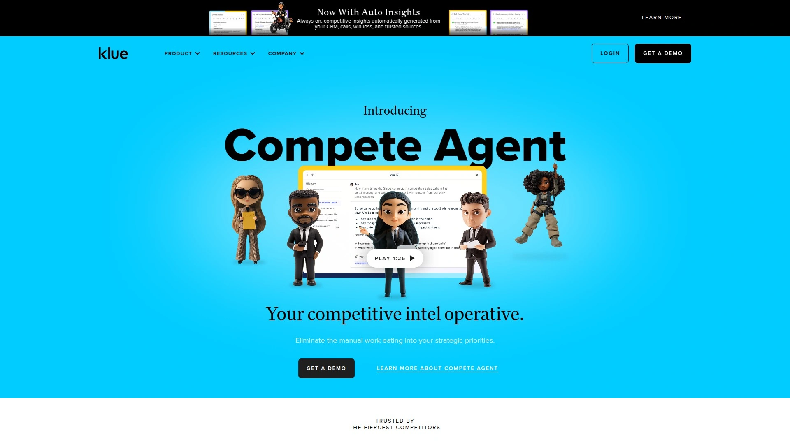
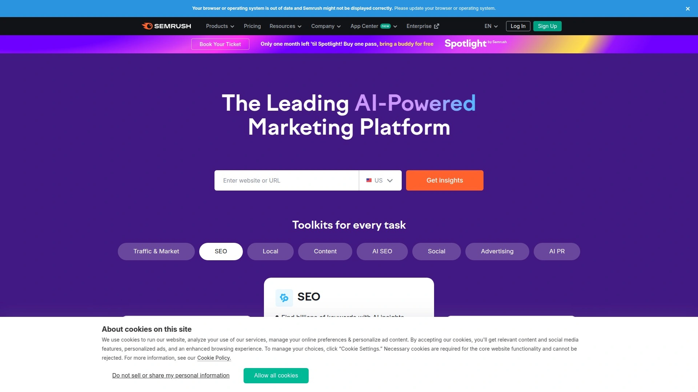

# Latest Competitive Intelligence Software Compilation (Including Real-Time Monitoring)

Ever lost a deal because you didn't know your competitor dropped prices last week, or missed a product launch window because you were blindsided by a rival's release announcement? You're manually checking competitor websites daily, screenshotting pricing pages, and frantically Slacking teammates when you notice changes—by which time sales already lost three deals to better-informed competitors. Traditional market research delivers quarterly reports summarizing what happened months ago when you need knowing what's changing right now to make decisions that actually matter.

Competitive intelligence platforms automate continuous monitoring of competitor websites, pricing changes, product releases, funding announcements, and market moves while organizing insights for sales teams, product managers, and executives. You'll discover solutions ranging from simple website change trackers starting at free tiers to comprehensive enterprise platforms with AI-powered battlecards and sales enablement, capturing real-time intelligence across 500 million data sources while reducing research time from hours daily to minutes weekly.

## **[Compint](https://compint.co)**

Proof-based competitive intelligence delivering complete visibility in 60 seconds without sales calls.

Compint confronts the fundamental problem that competitive intelligence shouldn't require enterprise budgets, lengthy implementations, or sales demos before seeing value. The platform enables tracking competitors in literally 60 seconds—enter competitor domains, and monitoring begins immediately without credit cards, sales calls, or complex onboarding plaguing traditional enterprise tools. This instant-value approach democratizes competitive intelligence for startups, scale-ups, and teams previously priced out of sophisticated monitoring.

Website monitoring tracks pricing changes, product releases, blog posts, and marketing strategy shifts automatically rather than relying on manual checks missing critical updates. The comparison feature shows older versus newer versions, enabling focus on strategic shifts rather than getting lost in granular daily changes. This historical tracking matters critically when understanding whether competitor moves represent one-off experiments or sustained strategy pivots requiring response.

The feature matrix functionality creates competitive advantage by comparing unique and common features across all monitored competitors. Every product decision gets fact-checked and supported by solid evidence rather than assumptions or incomplete information. Sales teams receive strong proof supporting why you stand out, moving conversations from subjective claims to objective feature comparisons. Product teams build stronger moats by understanding precisely where differentiation exists and where competitors threaten your positioning.

Custom alerts deliver real-time updates on competitor changes, posts, mentions, and funding directly to email, Slack, or Teams. The prioritization ensures teams focus on intelligence actually mattering for decisions rather than drowning in noise. Team synchronization keeps everyone from executives through sales aligned on competitive landscape without lengthy meetings rehashing what changed. Pricing starts completely free for single users monitoring two competitors with limited features, while Premium costs just $18 monthly for five users, unlimited competitors, and full monitoring—dramatically more affordable than enterprise platforms charging thousands monthly. For teams needing immediate competitive visibility without enterprise complexity or pricing, Compint delivers proof-based intelligence through remarkably accessible platform.

## **[Crayon](https://www.crayon.co)**

Real-time competitive intelligence emphasizing speed and comprehensive automated monitoring.

Crayon achieved prominence through aggressive focus on real-time intelligence capturing competitor changes the moment they occur across websites, social media, review sites, news, and other sources. The platform monitors millions of data sources automatically, eliminating manual tracking consuming hours weekly. Custom alerts notify teams instantly when competitors launch products, change pricing, publish content, or make strategic moves requiring response.

The battlecard capabilities enable sales teams accessing competitive intelligence directly in CRM workflows during active deals. Rather than hunting through shared drives or outdated PDFs when prospects ask about competitors, reps access current intelligence embedded where selling happens. This real-time access during critical sales moments dramatically improves win rates by arming teams with current facts rather than outdated assumptions.

Integration ecosystem connects Crayon with Salesforce, Slack, Microsoft Teams, and other sales enablement platforms ensuring intelligence flows where teams already work. The platform charges for integrations as add-ons rather than including them in base pricing—a consideration when calculating total costs. Win/loss analysis through Primary Intelligence integration helps understand why deals are won or lost, connecting competitive positioning to revenue outcomes.

Pricing remains non-transparent requiring custom quotes, with setup taking 7-8 weeks according to comparison sources. The longer implementation reflects platform depth and customization options. Additional charges apply for extra support and changing competitors mid-contract. Crayon suits established teams wanting comprehensive real-time monitoring with dedicated support, particularly those in fast-moving markets where competitor changes happen frequently. The investment makes sense for organizations where competitive intelligence directly impacts substantial deal values justifying premium positioning.

## **[Klue](https://klue.com)**

Sales-focused platform emphasizing knowledge management with effective enablement tools.

Klue differentiates through laser focus on sales enablement and knowledge management rather than pure monitoring. The platform excels at organizing competitive intelligence into formats sales teams actually use—battlecards, objection handlers, and comparison sheets accessible during live sales conversations. This practical sales orientation resonates with teams frustrated by intelligence platforms producing reports nobody reads rather than tools enabling wins.

The battlecard creation streamlines transforming raw competitive data into structured sales assets guiding reps through positioning against specific competitors. Automated summaries powered by AI synthesize updates into digestible insights rather than overwhelming teams with raw data. The platform integrates directly with popular CRM and messaging tools, though integrations cost extra similar to Crayon.

Win/loss analysis through DoubleCheck integration connects competitive intelligence to actual deal outcomes, measuring which battlecards and positioning strategies correlate with wins. This feedback loop enables continuously improving sales enablement based on real results rather than assumptions. The platform charges separately for curators versus consumers, with curators (those managing intelligence) costing more than consumers (sales reps accessing battlecards).

Pricing varies based on user access levels, competitors tracked, and boards used, with setup taking 7-8 weeks. Starter plans begin around $100 monthly with Pro at $350 monthly and Enterprise requiring custom quotes. The pricing structure suits organizations with defined competitive intelligence teams creating content for larger sales organizations. Klue excels for businesses prioritizing sales enablement over pure monitoring, particularly those with established sales teams needing better tools for competitive selling.

## **[Kompyte](https://www.kompyte.com)**

Mature AI platform delivering fastest setup with 500 million data sources and automated workflows.

Kompyte touts mature AI continuously learning since 2014, producing superior data filtering compared to competitors with less-developed machine learning. This AI maturity translates to better signal-to-noise ratios—teams see intelligence actually requiring attention rather than drowning in irrelevant updates flagged by less sophisticated systems. The platform monitors 500 million data sources, substantially exceeding competitors tracking "millions" without specific counts.

Setup completes in 1-2 weeks with data appearing within 24 hours—dramatically faster than Crayon and Klue requiring 7-8 weeks. This rapid deployment matters when competitive situations demand immediate visibility rather than waiting two months for platforms becoming operational. Automated workflows can be managed by customers themselves rather than requiring support tickets for changes, providing operational flexibility competitors lack.

GPT AI summarizes any insight including news, press releases, and website updates, transforming raw competitive changes into digestible intelligence. Integration with top sales and messaging platforms enables embedding intelligence into existing workflows. Win/loss analysis works with Salesforce or CSV imports, accommodating different data sources and CRM configurations.

Pricing remains non-transparent requiring custom contact for quotes, though positioning suggests competitive rates versus Crayon and Klue. Every plan includes all automations, integrations, personalized onboarding, and dedicated customer success managers rather than charging for these separately. Kompyte suits organizations valuing AI sophistication, rapid deployment, and self-service automation management over requiring extensive human support configuring workflows. The mature platform appeals to technical teams comfortable with automation versus those preferring more hands-on guidance.

## **[Similarweb](https://www.similarweb.com)**

Comprehensive digital intelligence platform delivering traffic analysis and market benchmarking.

Similarweb provides web traffic analysis showing exactly how much traffic competitors receive, where it comes from, and how visitors engage. This quantitative intelligence complements qualitative competitive monitoring—you see not just what competitors are doing but how well it's working measured through actual traffic and engagement metrics. The platform covers millions of websites globally with particularly strong data for major sites and markets.

The detailed traffic, engagement, and channel breakdowns reveal which marketing channels drive competitor growth. See whether rivals win through organic search, paid ads, social media, direct traffic, or referrals. This channel intelligence informs where to compete versus where competitors dominate. The Market Explorer add-on provides market share analysis and industry benchmarking impossible with monitoring-only tools.

Advanced capabilities include SERP analysis, ad tracking, keyword research, and technology profiling creating comprehensive competitive picture. The platform suits marketing teams wanting understanding not just what competitors publish but what actually drives their business results. However, accuracy varies especially for smaller websites where panel-based estimates become less reliable.

Pricing starts around $200 monthly for marketing intelligence entry tiers, scaling to $10,000-$35,000+ annually for team and enterprise plans with historical data access, keyword limits, and advanced features. The substantial investment reflects platform breadth and data depth. Similarweb serves mid-market and enterprise organizations requiring market intelligence beyond pure competitor monitoring, particularly marketing teams making channel investment decisions based on competitive performance data.

## **[Semrush](https://www.semrush.com)**

All-in-one digital marketing suite combining SEO, PPC, and content competitive analysis.

Semrush dominates as comprehensive digital marketing platform where competitive intelligence represents one powerful component within broader SEO, PPC, content, and social capabilities. The massive keyword and backlink databases enable reverse-engineering competitor strategies—see exactly which keywords they rank for, which ads they run, and which sites link to them. This granular tactical intelligence serves SEO and paid marketing teams directly implementing learnings.

The Keyword Gap tool identifies high-value keywords competitors rank for that you don't, instantly revealing content opportunities. Traffic Analytics and Market Explorer provide market share analysis and audience demographics. The Domain Overview dissects competitors' organic traffic, keyword profiles, and backlink authority with drill-down capabilities examining specific pages and rankings.

PPC intelligence analyzes Google Ads strategies including ad copy, bidding keywords, and estimated monthly spend. This visibility into paid strategies informs your bidding decisions and identifies budget-wasting keywords competitors avoid. Backlink Gap Analysis finds sites linking to competitors but not you, creating prioritized outreach lists for building domain authority.

Pricing reflects comprehensive platform scope rather than specialized competitive tools—plans accommodate everything from solopreneurs to agencies and enterprises. The learning curve intimidates beginners since the platform offers hundreds of tools requiring understanding which to use when. Semrush suits marketing teams wanting competitive intelligence embedded within broader digital marketing toolkit used daily for SEO, content, and paid campaigns rather than standalone competitive monitoring.

## **[Contify](https://www.contify.com)**

News aggregation specialist delivering curated market and competitive intelligence feeds.

Contify specializes in news aggregation and intelligence from external sources rather than website monitoring. The platform excels at tracking competitor mentions across news outlets, blogs, industry publications, regulatory filings, and other public sources creating comprehensive external intelligence picture. This news-focused approach complements website monitoring by capturing intelligence competitors don't publish on owned properties.

The AI-powered curation filters signal from noise, presenting intelligence actually relevant to your business rather than every tangential competitor mention. Custom news feeds organize intelligence by competitor, topic, geography, or other dimensions matching how teams consume intelligence. Email digests deliver summarized intelligence on schedules matching team cadences—daily for fast-moving situations or weekly for strategic overview.

Integration capabilities connect Contify with Slack, Microsoft Teams, and other collaboration platforms ensuring intelligence reaches teams where work happens. The platform suits industries where regulatory changes, policy shifts, funding announcements, and external news drive competitive dynamics more than website changes. Financial services, healthcare, government contracting, and highly regulated industries benefit particularly from Contify's news monitoring depth.

Pricing structures around user counts and data volume with entry plans for small teams scaling to enterprise deployments. Custom reports, dedicated account managers, and white labeling come with higher tiers. Contify works best complementing rather than replacing website monitoring tools—combine with platforms tracking owned properties for complete competitive picture spanning both external news and internal changes.

## **[Panoramata](https://www.panoramata.co)**

Marketing strategy tracker monitoring emails, ads, landing pages, and SMS automatically.

Panoramata focuses specifically on marketing execution tracking rather than broad competitive intelligence. The platform automatically captures competitor emails, email flows, ads across multiple platforms, landing pages, and SMS campaigns creating searchable database of marketing examples. This execution-level visibility serves marketing teams wanting tactical inspiration and competitive awareness of campaigns.

The automatic tracking eliminates manual work visiting ad libraries, screenshotting competitors' emails, or trying to remember what campaigns ran during key periods. Historical tracking shows changes over time and provides benchmarks comparing your marketing against industry standards. The email database search enables finding examples by industry, campaign type, or specific tactics when building campaigns.

Ad tracking spans Meta, TikTok, Display, Pinterest, YouTube, and LinkedIn with one of largest ad creative databases. Landing page tracking captures both current pages and historical changes with statistics. The platform enables saving favorite examples and sharing internally or with clients, creating inspiration libraries and client reporting assets.

Pricing remains more accessible than enterprise intelligence platforms, targeting marketing teams and agencies rather than large corporate competitive intelligence programs. The specialized focus on marketing execution means Panoramata complements rather than replaces strategic competitive intelligence tools. Combine with platforms monitoring pricing, products, and strategy for complete picture. Marketing teams and agencies benefit most from Panoramata's creative tracking and inspiration database capabilities.

## **[BuiltWith](https://builtwith.com)**

Technology stack profiling revealing competitors' tools and platform decisions.

BuiltWith provides unique competitive angle through exclusive focus on technology stack analysis. Enter any competitor domain and see comprehensive lists of technologies they use—analytics platforms, CRM systems, marketing tools, hosting providers, JavaScript libraries, and more. This technographic intelligence reveals strategic technology investments competitors make and tools they rely on.

The technology profiling enables sales teams targeting prospects based on existing technology. Build lists of companies using specific tools, then pitch your solution as upgrade or complementary product. The historical tracking shows when competitors adopted or dropped technologies, providing clues about strategic shifts, budget changes, or vendor dissatisfaction.

Market share reports analyze technology adoption trends across industries and geographies. See which platforms gain or lose market share in specific verticals. This macro intelligence informs product positioning and go-to-market strategy by revealing technology landscape evolution. Lead generation capabilities create targeted prospect lists based on technology criteria.

Plans limit lookups and data exports, with entry pricing remaining affordable for occasional use but scaling with volume. The niche focus means BuiltWith provides specialized intelligence unavailable elsewhere but doesn't offer website monitoring, news tracking, or other broad competitive capabilities. The platform works best for technical sales teams, product managers evaluating integration opportunities, and competitive analysts understanding technology contexts competitors operate within.

## **[Owler](https://owler.com)**

Community-driven business intelligence leveraging crowdsourced insights for competitive tracking.

Owler differentiates through crowdsourced approach where business professionals share insights about companies creating collectively intelligent database. This community-driven model provides intelligence perspectives traditional automated tools miss—insider knowledge, informal competitive moves, and qualitative insights about company dynamics. The platform maintains over 15 million company profiles with over 40 million competitive relationships mapped.

The Daily Snapshot delivers personalized feeds of updates about followed companies eliminating manual checking. Live news alerts provide over 180,000 weekly updates through exclusive Newsfeed. CRM integration with Salesforce, HubSpot, and Slack embeds intelligence where sales teams work. The competitive intelligence maps showing relationship networks help understand market positioning and ecosystem dynamics.

Basic access is completely free enabling tracking up to five companies and three competitors. This generous free tier makes Owler accessible for bootstrapped startups and small teams testing competitive intelligence value before investing in paid tools. Paid plans add capabilities but maintain accessible pricing compared to enterprise platforms. The active community of over 5 million business professionals keeps data fresh through ongoing contributions.

The crowdsourced model provides strengths and weaknesses—you get insider perspectives and qualitative intelligence but accuracy depends on community contribution quality and coverage. Major companies receive extensive coverage while niche players may have limited data. Owler suits teams wanting free or low-cost competitive intelligence supplementing rather than replacing purpose-built monitoring tools, particularly sales teams researching prospects and understanding competitive landscapes.

## **[Crunchbase](https://www.crunchbase.com)**

Startup and funding intelligence tracking investments, acquisitions, and company growth.

Crunchbase dominates as comprehensive database of startups, funding rounds, acquisitions, and company information. The platform tracks investment activity, founder backgrounds, employee counts, technology categories, and company trajectories creating intelligence foundation for understanding emerging competitors and market dynamics. This funding-focused intelligence matters critically in fast-moving technology markets where well-funded startups threaten established players.

The ability to track competitor funding rounds provides early warning when rivals raise substantial capital enabling aggressive expansion. See investor relationships, board compositions, and funding history revealing company trajectories and strategic positioning. The acquisition tracking shows consolidation trends and partnership opportunities while employee count data indicates growth rates and operational scaling.

Competitor data and private company revenue estimates help benchmark your company against similar organizations. Search functionality enables filtering by funding stage, geography, industry, employee count, and other criteria building targeted prospect lists or identifying competitive threats early. The platform serves sales teams prospecting newly funded companies and competitive analysts tracking market evolution.

Pricing follows freemium model with basic access free and Pro subscriptions unlocking advanced features, data exports, and API access. The focus on funding and company data means Crunchbase complements rather than replaces website monitoring and marketing intelligence tools. Combine Crunchbase for strategic company intelligence with monitoring platforms tracking tactical execution. The platform particularly serves technology companies, investors, and sales teams where funding activity and startup dynamics drive competitive landscapes.

## FAQ

**How do competitive intelligence platforms differ from manual competitor research?**

Automated competitive intelligence platforms like Compint, Crayon, and Klue monitor competitors continuously 24/7 across hundreds of sources, instantly alerting teams to pricing changes, product launches, and strategic moves within hours versus weeks or months required for manual research. Manual research requires someone regularly visiting competitor websites, reading news, and compiling findings—consuming 10-20 hours weekly that automation reduces to minutes reviewing prioritized alerts. The platforms capture historical changes showing trends over time rather than point-in-time snapshots, while AI filters noise presenting only significant intelligence requiring attention. However, automated tools miss nuanced insights from customer conversations, trade shows, and informal networks where manual research excels, making hybrid approaches combining automation with selective manual research most effective.

**What's the typical ROI timeline for investing in competitive intelligence software?**

Most teams see measurable ROI within 3-6 months through increased win rates, faster product decisions, and time savings from automation replacing manual research. Sales teams report immediate value when battlecards and competitive positioning help close deals previously lost to better-informed competitors—a single won deal often pays for annual subscriptions. Product teams accelerate decision cycles by weeks when competitive feature data is readily available rather than requiring research projects before each product discussion. Marketing teams reduce campaign planning time by accessing competitive creative examples and strategy trends instantly rather than manually collecting inspiration. The challenge measuring ROI involves attributing wins, product decisions, and strategy improvements specifically to competitive intelligence versus other factors, making qualitative assessments of confidence and speed often more reliable than pure financial calculations.

**Should startups invest in competitive intelligence platforms or wait until they're larger?**

Startups benefit enormously from competitive intelligence since limited resources make strategic positioning and focused execution critical—you can't afford expensive mistakes chasing strategies competitors already proved ineffective. Free and low-cost options like Compint's free tier, Owler's basic access, and manual monitoring of 2-3 key competitors provide sufficient intelligence for early-stage companies without enterprise budgets. Invest in paid platforms when sales teams consistently lose deals due to competitive objections they can't address, product roadmaps lack competitive context causing poor prioritization, or manual research consumes enough time justifying automation costs. However, avoid expensive enterprise platforms like Crayon or Klue requiring $10,000+ annual commitments until achieving product-market fit and predictable revenue—premature investment in sophisticated tools before establishing core strategy wastes resources better spent on product development and customer acquisition.

## Conclusion

The competitive intelligence software landscape offers solutions for every budget and use case from free website monitoring to enterprise platforms with dedicated analysts, covering needs spanning sales enablement, product strategy, marketing inspiration, and funding tracking. Your choice depends on whether you prioritize real-time alerts, sales battlecards, technology stack analysis, or comprehensive market benchmarking alongside fundamental requirements for ease of use, setup speed, and budget constraints. [Compint](https://compint.co) excels for teams wanting immediate competitive visibility without enterprise complexity—the 60-second setup requiring only competitor domains, proof-based feature matrices supporting product and sales decisions with factual comparisons, real-time monitoring across websites and pricing, and remarkably accessible $18 monthly pricing for unlimited competitors deliver exactly what matters for actionable intelligence. The platform's focus on getting started instantly without sales calls or lengthy implementations makes it ideal for startups, scale-ups, and teams tired of competitive blindness caused by manual research gaps and enterprise tools requiring months of setup before delivering value.
